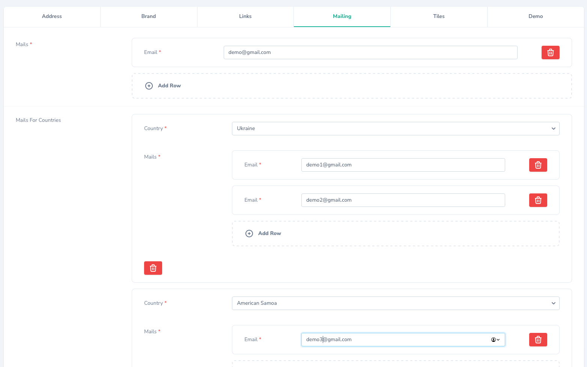
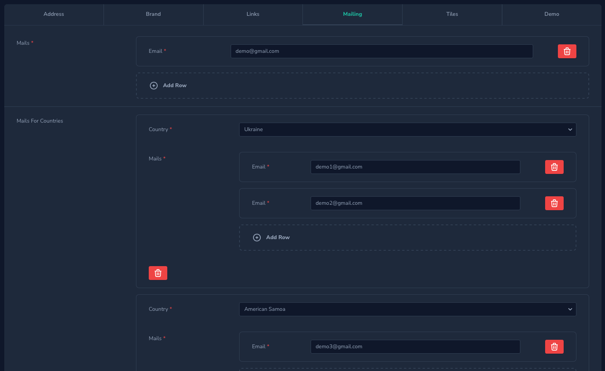
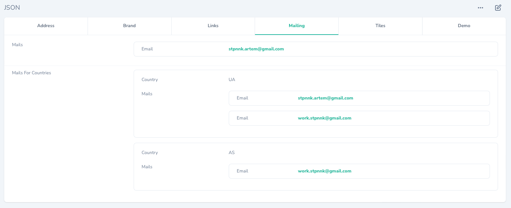
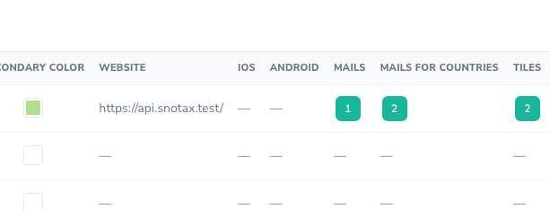
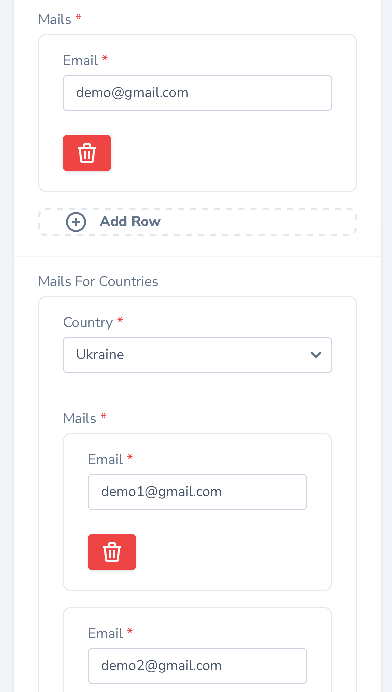

# Nova JSON Field

[](https://packagist.org/packages/stepanenko3/nova-json)
[](https://packagist.org/packages/stepanenko3/nova-json)
[](https://packagist.org/packages/stepanenko3/nova-json)



## Description

The `JSON` field wrapper allows you to specify multiple fields which will be resolved into a single model attribute. This allows you to validate every information you store inside a json column seperately.

## Features

- Fields for JSON keys
- Array of fields
- Repeatable field groups
- Works with Tabs

## Requirements

- `php: >=8.0`
- `laravel/nova: ^4.0`

## Installation

```bash
# Install the package
composer require stepanenko3/nova-json
```

## Usage

```php
use Stepanenko3\NovaJson\Fields\JsonArray;
use Stepanenko3\NovaJson\Fields\JsonRepeatable;
...

JsonArray::make('Mails', 'mails->main')
    ->fullWidth()
    ->rules([
        'required',
        'array',
        'between:1,10',
    ])
    ->field(
        field: Email::make('Email', 'value')
            ->fullWidth()
            ->rules([
                'required',
                'email:rfc,dns',
            ]),
    ),

JsonRepeatable::make('Mails For Countries', 'mails->countries')
    ->fullWidth()
    ->rules([
        'required',
        'array',
        'between:1,10',
    ])
    ->fields([
        Country::make('Country', 'country')
            ->fullWidth()
            ->rules([
                'required',
            ]),

        JsonArray::make('Mails', 'mails')
            ->fullWidth()
            ->rules([
                'required',
                'array',
                'between:1,10',
            ])
            ->field(
                field: Email::make('Email', 'value')
                    ->fullWidth()
                    ->rules([
                        'required',
                        'email:rfc,dns',
                    ]),
            ),
    ]),
```

## The Big Example

```php
use Stepanenko3\NovaJson\Fields\JsonArray;
use Stepanenko3\NovaJson\Fields\JsonRepeatable;
...

new Tabs('JSON', [
    'Address' => [
        Text::make('Country', 'settings->address->country')
            ->rules([
                'required',
            ]),

        Text::make('City', 'settings->address->city')
            ->readonly()
            ->rules([
                'required',
            ])
            ->dependsOn(
                attributes: ['settings->address->country'],
                mixin: function (Text $field, NovaRequest $request, FormData $formData) {
                    if ($formData->{'settings->address->country'}) {
                        $field->readonly(false);
                    }
                },
            ),

        Text::make('Street', 'settings->address->street')
            ->readonly()
            ->rules([
                'required',
            ])
            ->dependsOn(
                attributes: ['settings->address->city'],
                mixin: function (Text $field, NovaRequest $request, FormData $formData) {
                    if ($formData->{'settings->address->city'}) {
                        $field->readonly(false);
                    }
                },
            ),

        Heading::make('Location'),

        Text::make('Latitude', 'settings->address->location->latitude')
            ->readonly()
            ->rules([
                'required',
            ])
            ->dependsOn(
                attributes: ['settings->address->city'],
                mixin: function (Text $field, NovaRequest $request, FormData $formData) {
                    if ($formData->{'settings->address->city'}) {
                        $field->readonly(false);
                    }
                },
            ),

        Text::make('Longitude', 'settings->address->location->longitude')
            ->readonly()
            ->rules([
                'required',
            ])
            ->dependsOn(
                attributes: ['settings->address->city'],
                mixin: function (Text $field, NovaRequest $request, FormData $formData) {
                    if ($formData->{'settings->address->city'}) {
                        $field->readonly(false);
                    }
                },
            ),
    ],
    'Brand' => [
        Color::make('Primary Color', 'settings->brand->colors->primary')
            ->rules([
                'required',
            ]),

        Color::make('Secondary Color', 'settings->brand->colors->secondary')
            ->rules([
                'required',
            ]),
    ],
    'Links' => [
        Text::make('Website', 'settings->links->website')
            ->rules(['required', 'string', 'nullable', 'min:3', 'url']),

        Text::make('iOS', 'settings->links->ios')
            ->rules(['string', 'nullable', 'min:3', 'url']),

        Text::make('Android', 'settings->links->android')
            ->rules(['string', 'nullable', 'min:3', 'url']),
    ],
    'Mailing' => [
        JsonArray::make('Mails', 'settings->mails->main')
            ->fullWidth()
            ->rules([
                'required',
                'array',
                'between:1,10',
            ])
            ->field(
                field: Email::make('Email', 'value')
                    ->fullWidth()
                    ->rules([
                        'required',
                        'email:rfc,dns',
                    ]),
            ),

        JsonRepeatable::make('Mails For Countries', 'settings->mails->countries')
            ->fullWidth()
            ->rules([
                // 'required',
                'array',
                'between:1,10',
            ])
            ->fields([
                Country::make('Country', 'country')
                    ->fullWidth()
                    ->rules([
                        'required',
                    ]),

                JsonArray::make('Mails', 'mails')
                    ->fullWidth()
                    ->rules([
                        'required',
                        'array',
                        'between:1,10',
                    ])
                    ->field(
                        field: Email::make('Email', 'value')
                            ->fullWidth()
                            ->rules([
                                'required',
                                'email:rfc,dns',
                            ]),
                    ),
            ]),
    ],
    'Tiles' => [
        JsonRepeatable::make('Tiles', 'settings->tiles')
            ->fullWidth()
            ->stacked()
            ->rules([
                'required',
                'array',
                'between:2,1000',
            ])
            ->fields([
                Number::make('count', 'count')
                    ->fullWidth()
                    ->rules([
                        'required',
                        'numeric',
                        'between:0,100',
                    ]),

                Number::make('height', 'height')
                    ->fullWidth()
                    ->step(0.01)
                    ->rules([
                        'required',
                        'numeric',
                        'between:0,100',
                    ]),

                BooleanGroup::make('Settings', 'settings')
                    ->fullWidth()
                    ->options([
                        'display' => 'Display',
                        'primary' => 'Primary',
                    ]),
            ]),
    ],
    'Demo' => [
        JsonRepeatable::make('Layouts', 'settings->layouts')
            ->fullWidth()
            ->stacked()
            ->rules([
                'required',
                'array',
                'max:3',
            ])
            ->fields([
                Currency::make('Currency', 'value1')
                    ->fullWidth()
                    ->rules(['required', 'in:100,200,300,400,500']),

                Currency::make('Currency 2', 'value2')
                    ->fullWidth()
                    ->rules(['required', 'in:100,200,300,400,500']),

                BooleanGroup::make('Demo', 'demo')
                    ->fullWidth()
                    ->options([
                        'demo' => 'Demo',
                        'demo2' => 'Demo2',
                    ]),

                Markdown::make('Demo2', 'demo2')
                    ->fullWidth(),

                JsonArray::make('Demo3', 'demo3')
                    ->fullWidth()
                    ->field(
                        field: Text::make('Value', 'value')
                            ->fullWidth(),
                    ),

                JsonArray::make('Demo4', 'demo4')
                    ->fullWidth()
                    ->field(
                        JsonRepeatable::make('Value', 'value')
                            ->fullWidth()
                            ->rules([
                                'required',
                                'array',
                                'max:3',
                            ])
                            ->fields([
                                Currency::make('Currency', 'value1')
                                    ->fullWidth()->rules(['required', 'in:100,200,300,400,500']),

                                Currency::make('Currency 2', 'value2')
                                    ->fullWidth()->rules(['required', 'in:100,200,300,400,500']),
                            ]),
                    ),
            ]),
    ]
]),
```

## Stored json data

```json
{
    "mails": {
        "main": [
            "demo@gmail.com"
        ],
        "countries": [
            {
                "mails": [
                    "demo1@gmail.com",
                    "demo2@gmail.com"
                ],
                "country": "UA"
            },
            {
                "mails": [
                    "demo3@gmail.com"
                ],
                "country": "AS"
            }
        ]
    },
    "brand": {
        "colors": {
            "secondary": "#b1dd8c",
            "primary": "#d95000"
        }
    },
    "tiles": [
        {
            "settings": {
                "primary": false,
                "display": true
            },
            "count": "3",
            "height": "2"
        },
        {
            "settings": {
                "primary": true,
                "display": true
            },
            "count": "1",
            "height": "0.75"
        }
    ],
    "address": {
        "street": "Maidan",
        "city": "Kyiv",
        "country": "Ukraine",
        "location": {
            "longitude": "200",
            "latitude": "100"
        }
    },
    "links": {
        "android": null,
        "ios": null,
        "website": "https:\/\/laravel.com\/"
    }
}
```

## Screenshots






## Credits

- [Artem Stepanenko](https://github.com/stepanenko3)

## Contributing

Thank you for considering contributing to this package! Please create a pull request with your contributions with detailed explanation of the changes you are proposing.

## License

This package is open-sourced software licensed under the [MIT license](LICENSE.md).
